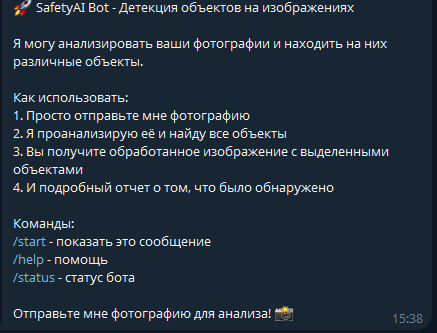
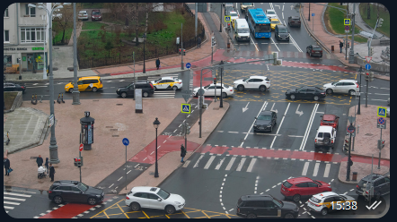
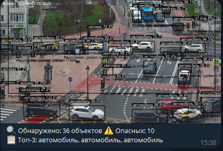
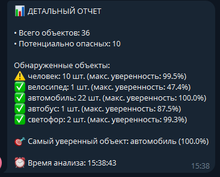

🤖 Умный Telegram-бот для классификации изображений. Просто отправьте картинку, и бот определит, 
что на ней изображено, используя мощь искусственного интеллекта.

=====================================================================================================================================

🧠 О проекте
Этот проект представляет собой Telegram-бота, который использует предварительно обученную модель глубокого обучения для классификации изображений. 
Модель была обучена на знаменитом наборе данных ImageAI с помощью модели YOLOv3 Model - yolov3.pt и способна распознавать более 1000 различных категорий объектов — от животных и транспорта до предметов.

Основная цель проекта: продемонстрировать практическое применение нейронных сетей в удобном и доступном формате мессенджера.

======================================================================================================================================

⚙️ Как это работает
1. Запрос: Пользователь отправляет боту изображение.

2. Обработка: Бот загружает изображение и предварительно обрабатывает его (изменение размера, нормализация) для соответствия входным требованиям модели.

3. Классификация: Обработанное изображение передается в нейронную сеть (например, ObjectDetection,  RetinaNet, YOLOv3 and TinyYOLOv3. и т.д.).

4. Прогноз: Модель возвращает вероятности для различных классов объектов.

5. Ответ: Бот выбирает класс с наивысшей вероятностью и отправляет понятный ответ пользователю на русском языке.

=======================================================================================================================================

✨ Функциональность
📷 Классификация изображений: Отправьте фото, чтобы узнать, что на нем изображено.

🎯 Высокая точность: Используется современная архитектура нейронной сети, обеспечивающая высокую точность распознавания.

🇷🇺 Русский язык: Интерфейс и ответы бота полностью на русском.

⚡ Быстрый отклик: Оптимизированный код обеспечивает быструю обработку запросов.

🚀 Простота использования: Не требует никаких специальных знаний — просто отправьте картинку.

========================================================================================================================================

🚀 Установка и запуск
Следуйте этим шагам, чтобы запустить бота на своем сервере.

Предварительные требования
Python 3.8 или выше

pip (менеджер пакетов Python)

Токен Telegram-бота (получите у @BotFather)

========================================================================================================================================

1. Клонирование репозитория
git clone https://github.com/your_username/your_repository_name.git
cd your_repository_name

2. Создание виртуального окружения (рекомендуется)
python -m venv venv
source venv/bin/activate  # Для Linux/macOS
venv\Scripts\activate     # Для Windows

3. Установка зависимостей
pip install -r requirements.txt

4. Настройка конфигурации
Создайте файл .env в корневой папке проекта и добавьте в него ваш Telegram Bot Token:
BOT_TOKEN=your_telegram_bot_token_here

5. Запуск бота
python bot.py

=========================================================================================================================================

💬 Использование
1. Найдите бота в Telegram по имени @your_bot_username.

2. Начните диалог, нажав кнопку START.

3. Отправьте любое изображение (как файл или фото).

4. Дождитесь ответа от бота с результатом классификации.

==========================================================================================================================================

📸 Скриншоты
;
;
;
;

==========================================================================================================================================

🛠 Технологии
Python - основной язык программирования

python-telegram-bot - фреймворк для создания Telegram-ботов

PyTorch / TensorFlow - фреймворк для глубокого обучения (выберите один)

TorchVision / TensorFlow Hub - для работы с предобученными моделями

python-dotenv - для загрузки переменных окружения